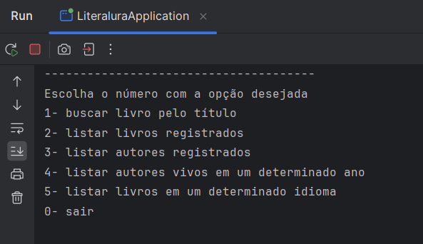
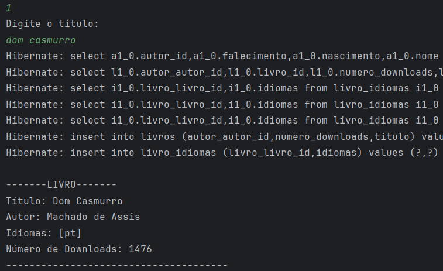

# LiterAlura - Challenge ONE (Alura + Oracle)

Nesse projeto, o desafio era desenvolver uma aplicação que através do consumo de uma API (Gutendex), fosse possível construir e editar um catálogo de livros online, sendo armazenado em um banco de dados, podendo trazer diversas informações desde os livros e até os autores.

## Objetivo do Projeto:
- *Desenvolver um Catálogo de Livros que ofereça interação textual (via console) com os usuários, proporcionando no mínimo 5 opções de interação. Os livros serão buscados através de uma API específica.*

## Tecnologias Utilizadas:

-  **Java**
-  **Spring Framework**
-  **JPA (Java Persistence API)**
-  **JSON**
-  **API: Gutendex**
-  **PostgreSQL**

## Demonstração do Menu Principal:

## Demonstração do consumo da API:

## Badge de conclusão do Challenge ONE:

  

